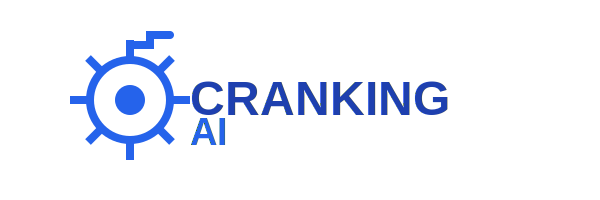

# Cranking AI

Cødergeist

## Images

Generated 24-Nov-2024 by Claude.ai based on these prompts:

**Prompt:** I want a logo for my new brand "Cranking AI" - as in cranking out new AI solutions - and I have @crankingai on twitter and the cranking.ai web domain.

---

**Response:**

I'll adjust the viewbox and spacing to ensure the full text is visible.

[cranking-ai-logo](./cranking-ai-logo.svg)

I've increased the viewBox width from 400 to 600 to ensure the full text is visible while maintaining all other design elements. The text "CRANKING" should now be completely visible while maintaining proper spacing and proportion with the gear element.

Would you like any other adjustments to the design? I could:

- Adjust the text size
- Modify the spacing between elements
- Change the gear size
- Alter the color scheme
- Adjust the positioning of any elements

## There was a false start on second image, then...

**Prompt:** I want a second image. The one already done will look good at full size, where space is less constrained. I want a second one  that will work when there is less space - and doesn't have room for spelling out "CRANKING AI" but can be miniaturized such as for a favicon and a twitter logo and other "square" or more constrained uses. Then if I have a matching pair I can choose the better one for the situation. SO using just the gear at the left create me this second image for when there's less space.

---

**Response:** I'll create a compact version focusing on just the gear/crank mechanism, optimized for small spaces like favicons and social media icons.

[cranking-ai-icon](./cranking-ai-icon.svg)

I've created a compact icon that:

1. Centers on just the gear/crank mechanism
2. Has thicker lines for better visibility at small sizes
3. Includes a subtle light blue background circle to help it stand out
4. Maintains the same design language as the full logo
5. Works in a perfect square format (200x200)

This version should work well for:

- Favicon (can be scaled down to 16x16 or 32x32)
- Social media profile pictures
- App icons
- Small embellishments where the full logo won't fit

The thicker lines and simpler design ensure it remains recognizable even at very small sizes. Would you like me to adjust anything about this compact version?
